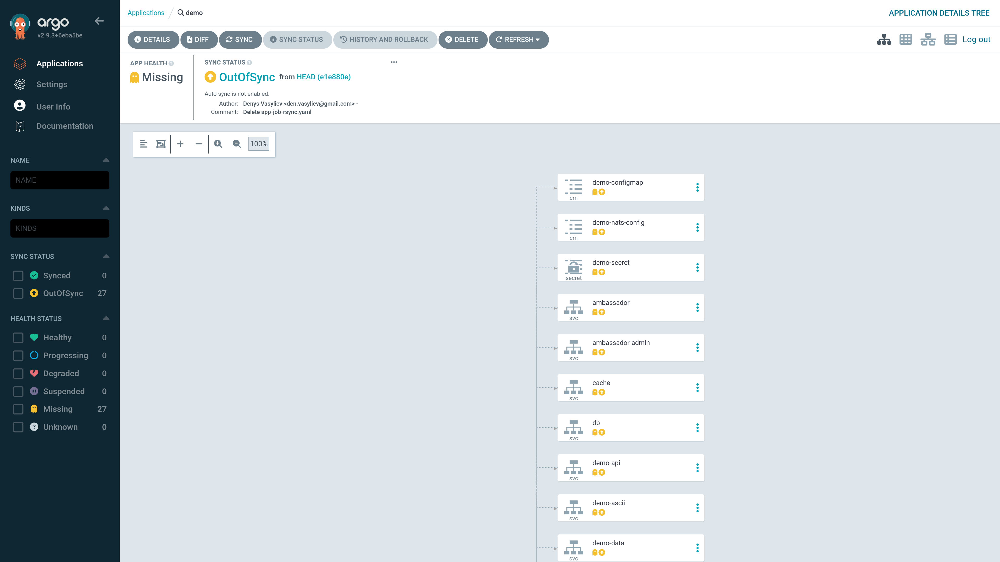

# MVP

This document instructs on how provided `demo` app works in `k3d`/`k3s` cluster
with installed `ArgoCD`.

## Prerequisites

- k3d/k3s with initial cluster `ascii-artify`
- ArgoCD is added and authorized as per [PoC](./POC.md)

## Add app and sync it

> Using UI:

Click on `+ NEW APP` and enter the following data in the side panel:

|form|field|value|comment|
|----|-----|-----|-------|
|GENERAL|Application Name|demo||
||Project Name|default||
||AUTO-CREATE NAMESPACE|true|Sync Options|
|SOURCE|Repository URL|https://github.com/alinkedd/go-demo-app||
||Path|helm||
|DESTINATION|Cluster URL|https://kubernetes.default.svc|local cluster|
||Namespace|demo||

Click on create and see the new app:


Click on created app. See the app in the `APPLICATIONS DETAILS TREE` view:



Click on `SYNC` button, review the resources that are going to be synchronized
and click on `Synchronize` button in the side panel. See the app in
`APPLICATION DETAILS NETWORK` view:


## Update app and resync

### NodePort to LoadBalancer

Change type `NodePort` to `LoadBalancer` in `ambassador` service in `helm`'s
`values.yaml` file, e.g. directly in GitHub:


Wait under 5 minutes and see `OutOfSync` status:


Click on `SYNC` button and click on `Synchronize` button in the side panel:


Get info about services:

```sh
kubectl get svc -n demo
# NAME               TYPE           CLUSTER-IP      EXTERNAL-IP   PORT(S)              AGE
# ...
# ambassador         LoadBalancer   10.43.14.249    <pending>     80:30830/TCP         129m
# ...
```

### LoadBalancer to NodePort

To fix service, let's change type back to the NodePort. Then, click on
`REFRESH`:


Again, click on `SYNC` and then on `Synchronize` button in the side panel:


Get info about services:

```sh
kubectl get svc -n demo
# NAME               TYPE           CLUSTER-IP      EXTERNAL-IP   PORT(S)              AGE
# ...
# ambassador         NodePort       10.43.14.249    <none>        80:30830/TCP         136m
# ...
```

Later, the auto-sync policy should be enabled.

## Check demo app

Get access to the API gateway `ambassador`:

```sh
kubectl port-forward svc/ambassador -n demo 8088:80
```

`ambassador` is accessible at [http://localhost:8088](http://localhost:8088):

```sh
curl localhost:8088
# k8sdiy-api:599e1af
```

Let's test this image:


```sh
curl -F 'image=@./doc/assets/test/test-image-argocd.png' localhost:8088/img/
```

The result:


