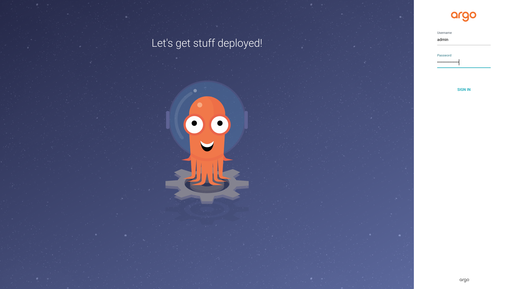
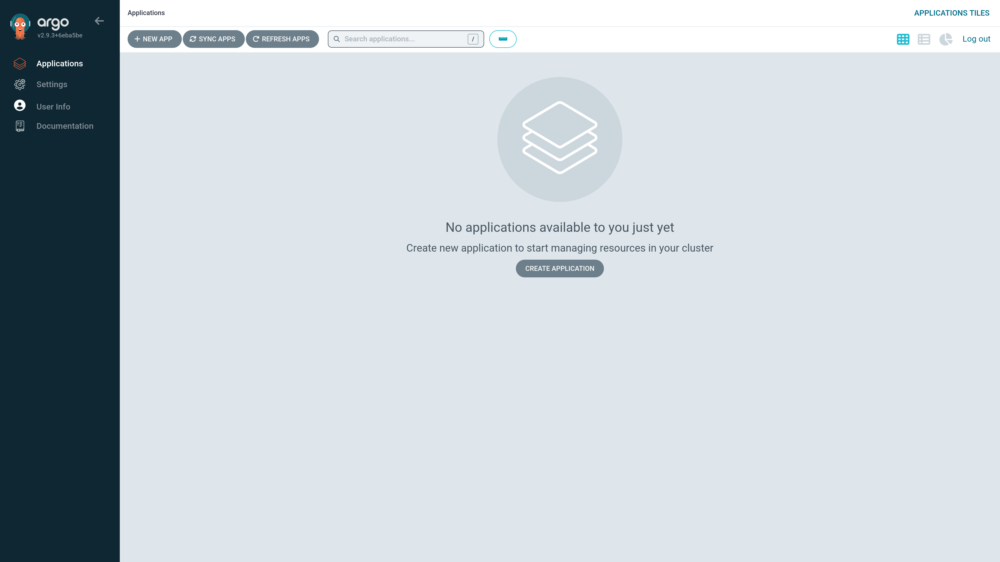

# PoC

This document instructs on how `k3d`/`k3s` with `ArgoCD` works.

## Prerequisites

- k3d/k3s with initial cluster `ascii-artify`

## Install and login

Install `ArgoCD` inside cluster:

```sh
kubectl create namespace argocd
kubectl apply -n argocd -f https://raw.githubusercontent.com/argoproj/argo-cd/stable/manifests/install.yaml
```

Get access to `ArgoCD` UI:

```sh
kubectl port-forward svc/argocd-server -n argocd 8080:443
```

UI is opened at [http://localhost:8080](http://localhost:8080)

To login, the basic username is `admin`. To get autogenerated password for it:

```sh
kubectl -n argocd get secret argocd-initial-admin-secret -o jsonpath="{.data.password}"| base64 -d
```

Copy password from terminal and sign in:




